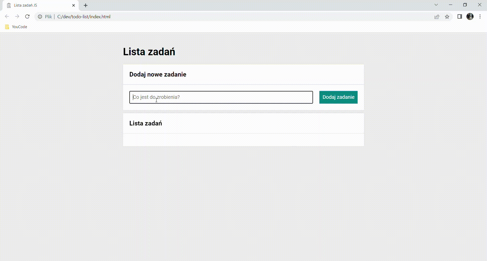

# Hubert Ludwiczak - task-list

## Demo

https://b3atman.github.io/task-list/

## Description

Presented tool allows you to create your own task list. Tasks can be added or deleted, as well as marked by tick, if you have completed them.

## Technologies
- HTML
- CSS
- Javascript
- React
- BEM convention
- Media Queries
- Open Graph Protocol
- Grid
- Immutability
- Normalize.css